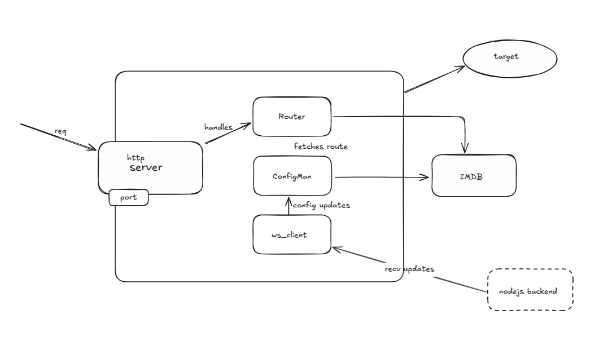

# DeltaX - API Gateway

  A performance-focused API Gateway built in C++ with full-stack management platform for real-time traffic control and observability.

---

<p align="center">
  
</p>

## ⚙️ Tech Stack

**Backend:** C++, CMake, Node.js, Express, PostgreSQL  
**Frontend:** React.js, Tailwindcss  
**Infra & DevOps:** Docker, Azure (ACR, AFS), WebSockets, JWT

---

## Overview

DeltaX is a high-performance API Gateway designed for scalable, secure, and efficient request routing. It includes:

- An HTTP server in C++ supporting:
  - WebSocket connections
  - Rate limiting
  - Load balancing
  - JWT-based authentication

- A full-stack admin interface built with:
  - **Node.js + Express** for backend APIs
  - **React.js** for dashboard & management UI

- Cloud-native deployment using:
  - Docker
  - Azure Container Registry (ACR)
  - Azure File Share (AFS) for persistent config storage

---


## Features

- **Custom API Gateway** in C++ with HTTP & WebSocket support
- **JWT-based Auth** for secure request routing
- **Admin Dashboard** built with React.js
- **Cloud Native**: Dockerized and deployed to Azure
- **Rate Limiting & Load Balancing**
- **Persistent Config Storage** using Azure File Share (AFS)

---

## 🧪 How to Run

### 1. Clone the repo

```bash
git clone https://github.com/shashidhxr/deltax.git
cd deltax

mkdir build && cd build
cmake ..
make
./deltax


# In backend/ (you have to run a backend which sends realtime updates in db via websocket on port 3000)
npm install
npm start

# In frontend/
npm install
npm run dev

Make sure your PostgreSQL instance is running and correctly configured.
```

## Development Roadmap
- Add OAuth 2.0 and mTLS support
- Prometheus-based metrics collection
- Real-time analytics & request tracing
- Multi-cloud deployment (AWS, GCP, Azure)
- Replace WebSocket with gRPC streaming

